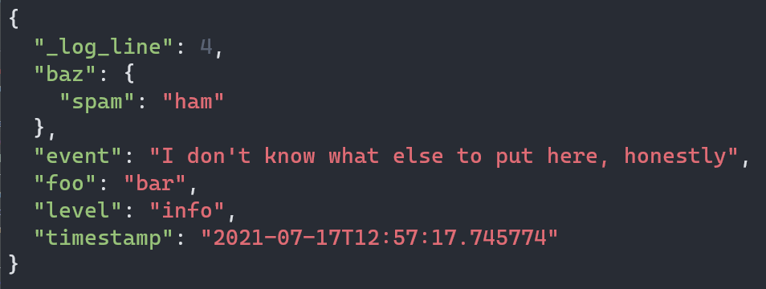

# Enlightened Elks' simple JSON log reader

A TUI program for interpreting JSON-formatted log output, such as those generated by ['structlog'](https://www.structlog.org/en/stable/) when using `JSONRenderer` output.

## Installation

Run the following in a new virtual environment to install dependencies:

```bash
pip install orjson~=3.6 prompt-toolkit~=3.0
```

> NOTE our [`requirements.txt`](requirements.txt) is out of date at the moment, but we missed the deadline to make changes prior to submission. The above install instruction is all it takes, though.

## Usage

The main program can be found in ['src/main.py'](src/main.py). Run this and point it at a log file using `-f` argument, like so:

```bash
python src/main.py -f data/sample.log
```

With the program open, each line of the log file (expected to use JSON format for each line) will be expanded and colorized. Each line will have the key `_log_line` added to it, showing the line number of that log entry, starting from 1.

Example, this entry:

```json
{
  "foo": "bar",
  "baz": { "spam": "ham" },
  "event": "I don't know what else to put here, honestly",
  "level": "info",
  "timestamp": "2021-07-17T12:57:17.745774"
}
```

Displays as:



### Key bindings

| Key                 | Action                   |
| ------------------- | ------------------------ |
| Left or Up arrow    | Show previous log line   |
| Right or Down arrow | Show next log line       |
| `F`                 | Go to **f**irst log line |
| `L`                 | Go to **l**ast log line  |
| `Ctrl-C`            | Quit program             |
